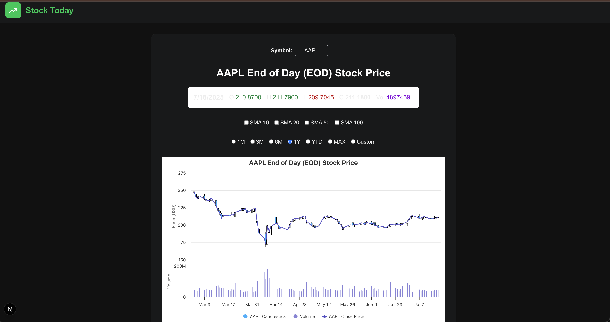

# Stock Today

[Live Demo](https://stock-today-bsiq.vercel.app/)

A modern, investor-focused web app for visualizing end-of-day (EOD) stock prices with advanced charting features, built with Next.js, React, and Highcharts.

---

## Screenshot



*Example: AAPL candlestick, volume, and SMA overlays*

---

## Features

- **Symbol Search:** Instantly search and switch between popular stock symbols.
- **Candlestick Chart:** Interactive candlestick chart for daily OHLC (Open, High, Low, Close) data.
- **Volume Bars:** Visualize daily trading volume as a column chart below the price chart.
- **SMA Overlays:** Toggle Simple Moving Averages (SMA) for 10, 20, 50, and 100-day periods.
- **Period Selection:** View data for 1M, 3M, 6M, 1Y, YTD, MAX, or a custom date range.
- **Enhanced Tooltip:** Rich tooltip displays OHLC, volume, and all selected SMAs for each day.
- **Crosshair Cursor:** Precise crosshair for reading values and dates.
- **Responsive Design:** Optimized for both desktop and mobile devices.
- **Error Handling:** User-friendly messages for invalid symbols, API errors, or no data.
- **Modern UI:** Clean, dark-themed interface with intuitive controls.

---

## Technologies Used

- **Next.js** (App Router, SSR/CSR)
- **React 19**
- **Highcharts** (with Stock module)
- **highcharts-react-official**
- **Tailwind CSS** (custom dark theme)
- **Alpha Vantage API** (for EOD stock data)
- **TypeScript** (type safety)

---

## Getting Started

### Prerequisites
- Node.js (v18+ recommended)
- Alpha Vantage API key (free at https://www.alphavantage.co/support/#api-key)

### Installation

```bash
git clone https://github.com/your-username/stock-today.git
cd stock-today
npm install
```

### Environment Setup

Create a `.env.local` file in the root directory:

```
NEXT_PUBLIC_ALPHA_VANTAGE_KEY=your_alpha_vantage_api_key
```

### Running Locally

```bash
npm run dev
```

Visit [http://localhost:3000](http://localhost:3000) in your browser.

---

## Project Structure

```
src/
  app/
    page.tsx         # Main page and chart logic
    layout.tsx       # App layout
    globals.css      # Global styles (Tailwind)
  components/
    Navbar.tsx       # Top navigation bar
    OhlcDisplay.tsx  # OHLC value display
    SMASelector.tsx  # SMA toggle controls
    PeriodSelector.tsx # Period selection controls
    SymbolInput.tsx  # Symbol search input
  hooks/
    useAlphaVantage.ts # Data fetching hook
  interfaces/
    alphaVantage.ts  # TypeScript interfaces for API
  constants/
    index.ts         # App constants
  utils/
    index.ts         # Utility functions
```

---

## Important Note About Data Limits

If you see a message like `No data found for symbol "XYZ"` for a valid stock symbol, it may be because the [Alpha Vantage](https://www.alphavantage.co/) free API daily request limit has been reached. The free tier allows only a limited number of requests per day. If this happens, please try again the next day or consider upgrading your Alpha Vantage plan for higher limits.

---

## Credits

- [Highcharts](https://www.highcharts.com/)
- [Alpha Vantage](https://www.alphavantage.co/)
- [Next.js](https://nextjs.org/)
- [Tailwind CSS](https://tailwindcss.com/)

---

## License

MIT
